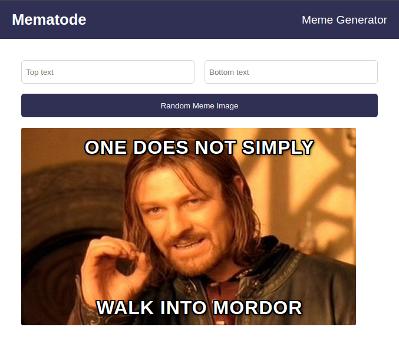

# Mematode App

_**Notes:** This project is a work in progress._

## Table Of Contents

- [About](#about)
- [Description](#description)
- [Features](#features)
- [Demo](#demo)
- [Stack](#stack)

## About

A spartan meme generator web application.

The name 'Mematode' derives from the portmanteau of 'meme' and 'nematode'.

## Description

The objective is to learn React and ES6 features, especially:

- props and state
- `useState`
- event listeners
- forms
- API calls
- `useEffect`
- array destructuring
- `&&` operator
- ternary operator

## Features

## Demo

https://mematode.vercel.app/

## Stack

- React 18
- Vite 5
